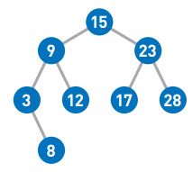
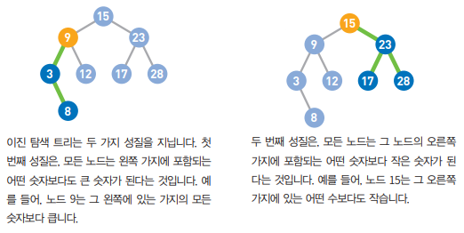
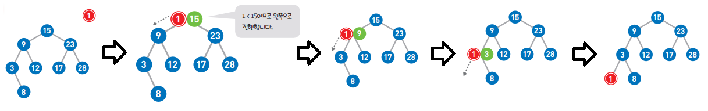
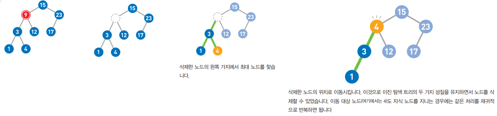

# 이진 탐색 트리

- 그래프의 트리 구조를 사용
- 각 노드는 최대 2개의 자식 노드를 가짐

- 이진 탐색 트리 성질

  
  
  

- 데이터 추가

  

  

- 데이터 삭제

  

- 데이터 탐색 시 O(log n), 트리가 한쪽으로 치우쳐 직선에 가까운 모양이 된다면 트리가 높아져서 O(n)
- 트리가 한쪽으로 치우친 경우 모양을 바로잡기 위해 항상 균형을 유지하도록 하는 자가 균형 이진 탐색 트리
- 자식 노드가 m개로 확장해서 자식 수에 제한을 두지 않고 트리의 균형을 도모한 B 트리

