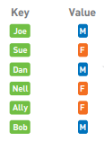
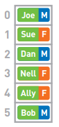
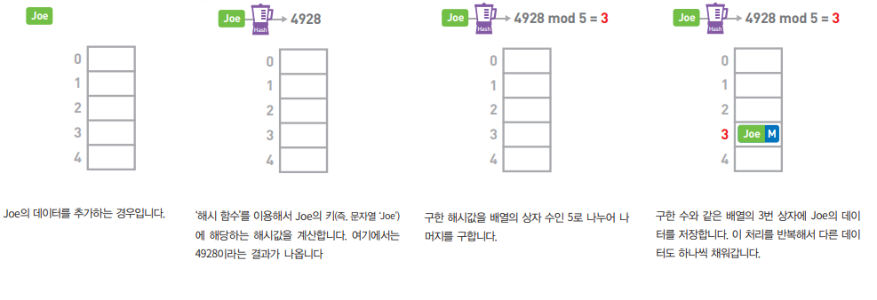
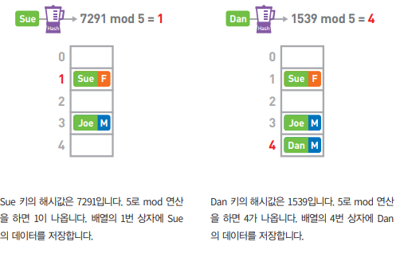
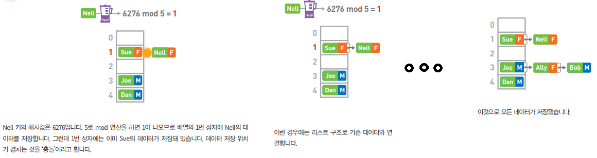
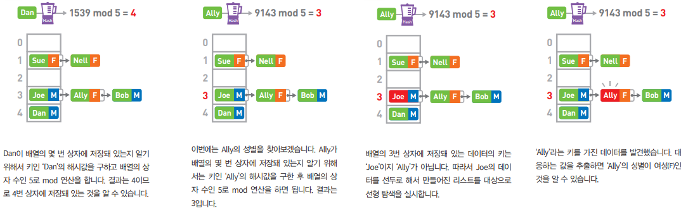

# 해시 테이블

- 해시 함수와 함께 데이터 검색을 효율적으로 하기 위한 구조
- key와 value가 한 쌍을 이루는 데이터
- 데이터의 유연한 저장과 빠른 접근이 가능한 해시 테이블은 연관 배열 등에 사용

- 배열에 저장한 경우

  

> > 앞에서부터 차례대로 확인하므로 선형 탐색
> >
> > 선형 탐색은 데이터양에 비례해서 계산 시간이 늘어나 탐색에는 적합하지 않은 구조

- 해시 테이블에 저장한 경우

  - 데이터 추가

    

    

    

  - 데이터 접근

- 해시 테이블은 해시 함수를 이용해서 배열 내의 특정 데이터에 빠르게 접근 가능

- 해시값이 충돌할 때는 리스트를 이용하고 있어 유연하게 대응 

- 해시 테이블에 사용하는 배열의 크기는 너무 작으면 충돌이 많아지고 선형 탐색의 빈도가 높아짐

- 배열의 크기가 너무 크면 데이터가 없는 상자가 많아져서 메모리를 낭비

- 충돌이 발생하는 경우 리스트를 사용한 방법을 연쇄법(chaining)

- 연쇄법 이외에 충돌 시의 처리 방법

  - 개방 주소법 : 충돌이 발생한 경우 다음 후보가 될 주소를 구해서 거기에 저장

  
