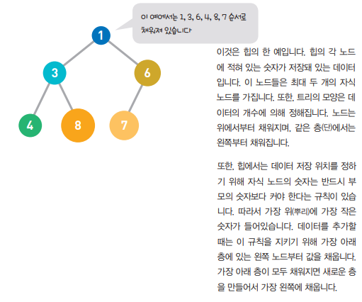
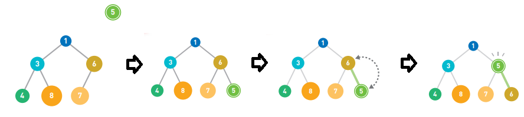
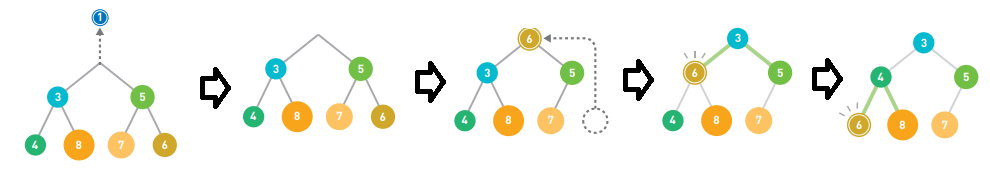

# 힙

- 그래프의 트리 구조 중 하나로 우선순위 큐를 구현할 때 사용
- 데이터를 자유롭게 추가 가능하지만 데이터 추출할 때는 최솟값부터 순서대로 선택

- 데이터 추가

  

> > 앞에서부터 차례대로 확인하므로 선형 탐색
> >
> > 선형 탐색은 데이터양에 비례해서 계산 시간이 늘어나 탐색에는 적합하지 않은 구조

- 데이터 추출

  

  

- 힙은 항상 가장 위에 최솟값이 있어 O(1) 시간에 최솟값을 추출

- 추출 후 재구축할 때 계산 시간은 트리의 높이와 비례하여  O(log n)

  

