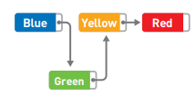
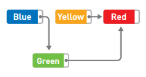
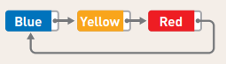
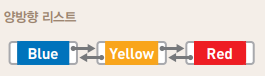

# 리스트

- 데이터를 일직선으로 나열한 형태
- 데이터 추가나 삭제는 쉽지만, 접근에 시간이 많이 걸림

> Red의 포인터는 아무것도 가리키지 않음.  

> 처음부터 순서대로 따라가야만 원하는 데이터에 접근 가능(순차 접근 또는 sequential access)

- 데이터 추가 (green 추가)

- 데이터 삭제 (yellow 삭제)

> green의 포인터를 red를 가리키도록 변경
>
> yellow는 메모리에 남지만 어디에서도 접근할 수 없어 삭제할 필요가 없음.

- 시간복잡도 (데이터 수가 n)

  > 데이터 접근 시 O(n)
  >
  > 데이터 추가 시 O(1)
  >
  > 데이터 추가 시 O(1)

- 원형 리스트 (순환 리스트)

> 원형 리스트에 선두나 후미라는 개념은 없음

- 양방향 리스트

  

  > 앞뒤로 접근 가능해 좋지만 포인터 수가 늘어나고, 추가나 삭제 시에도 변경해야할 포인터가 늘어남

