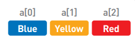
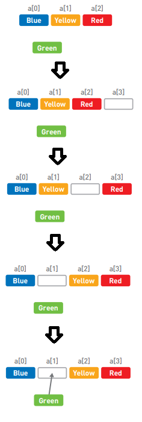

# 배열

- 데이터를 1열로 나열한 형태
- 데이터 접근은 쉽지만, 추가나 삭제에 시간이 많이 걸림

> > 데이터는 연속된 메모리 영역에 순서대로 저장
> >
> > 각 데이터에 바로 접근 가능(임의접근, random access)

- 데이터 추가 (green a[1]에 추가)

- 데이터 삭제 (green 삭제)5

- 시간복잡도 (데이터 수가 n)

  

> > 데이터 접근 시 O(1)
> >
> > 데이터 추가 시 O(n)
> >
> > 데이터 삭제 시 O(n)

- 원형 리스트 (순환 리스트)

> > 원형 리스트에 선두나 후미라는 개념은 없음

- 양방향 리스트

  

> > 앞뒤로 접근 가능해 좋지만 포인터 수가 늘어나고, 추가나 삭제 시에도 변경해야할 포인터가 늘어남

